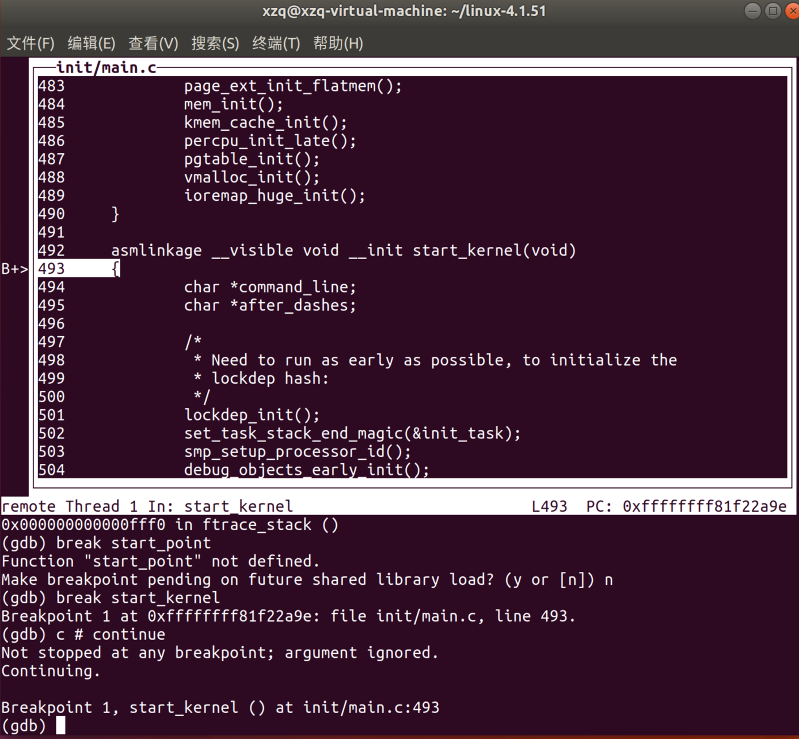
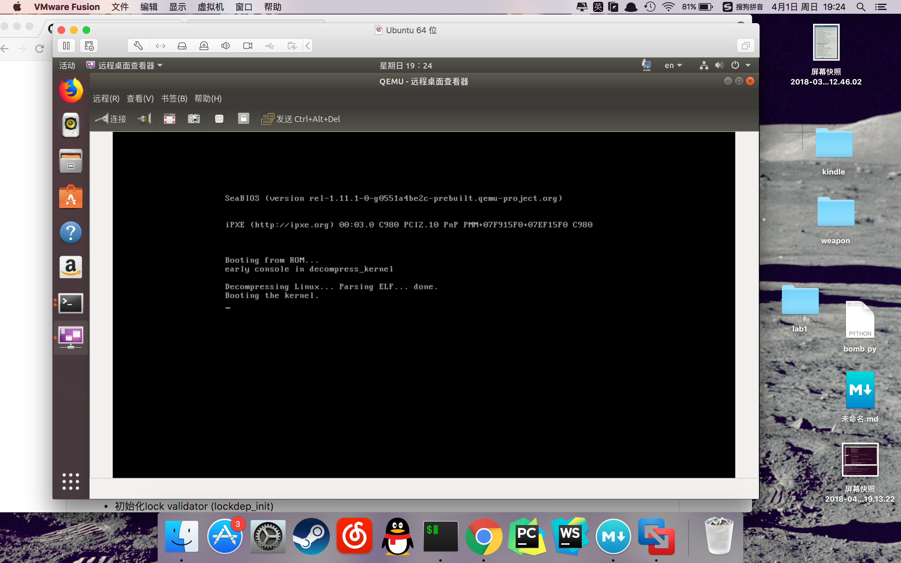
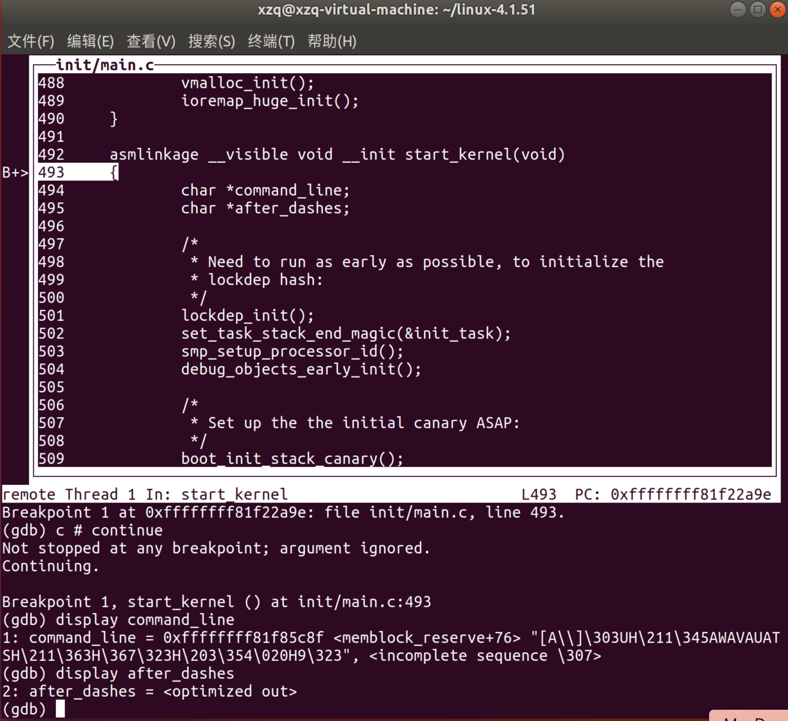
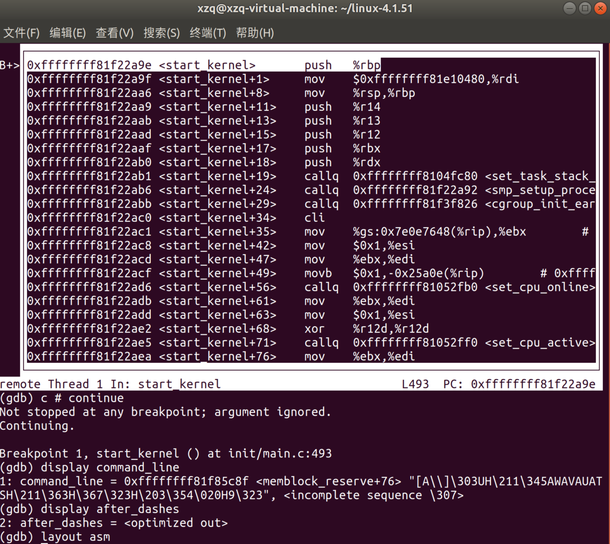
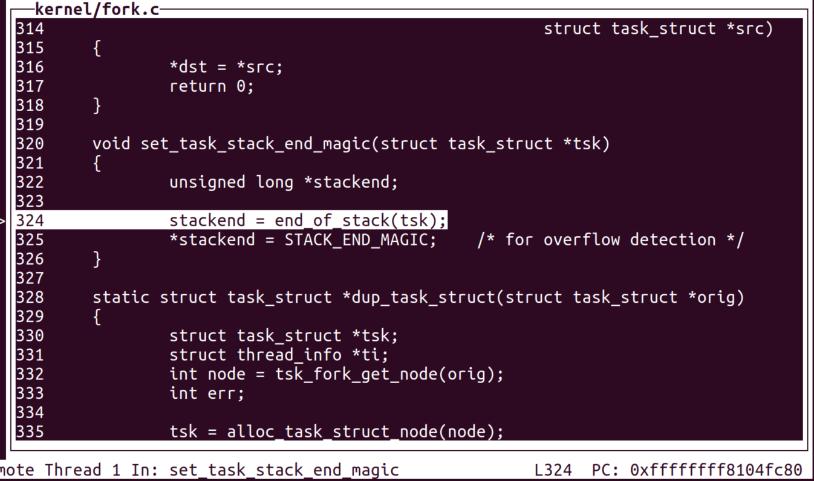
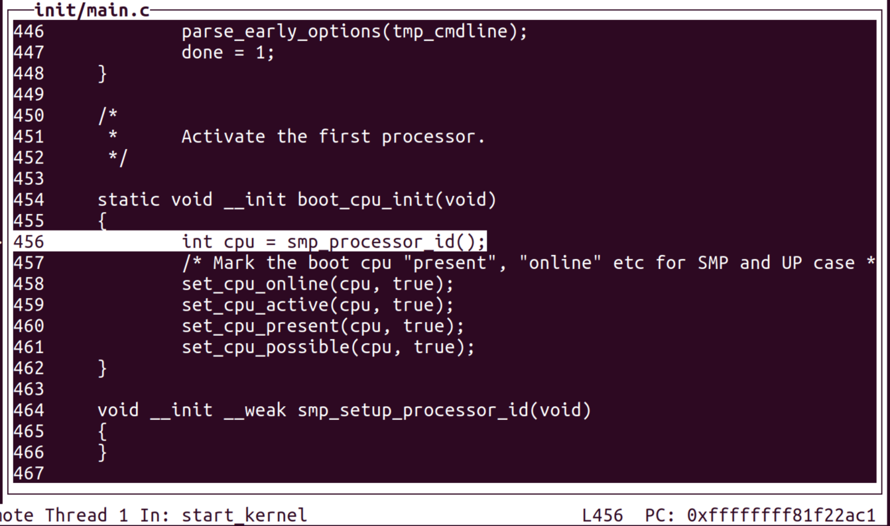
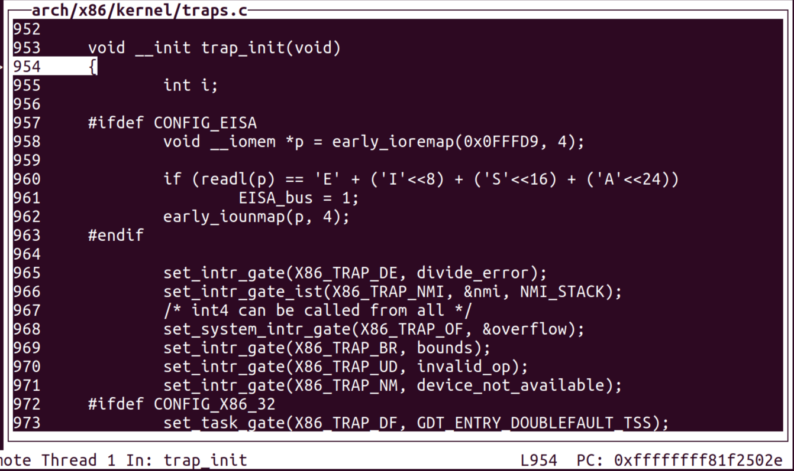
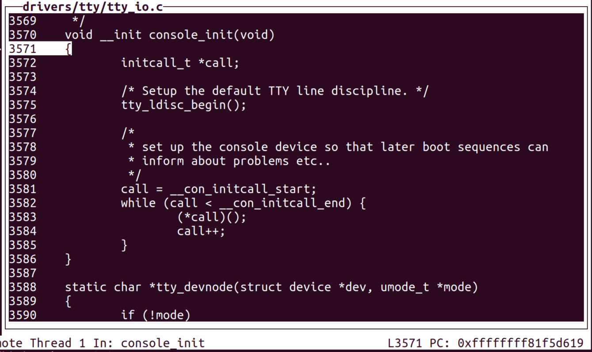
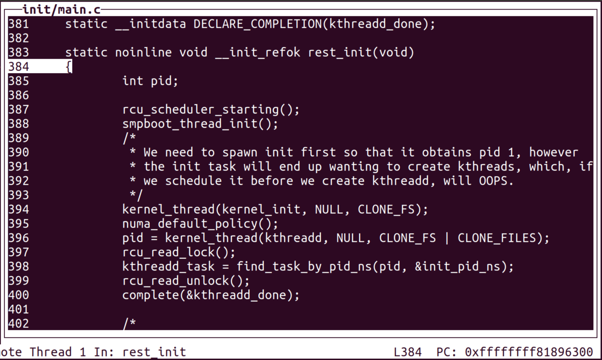

#Linux启动过程追踪实验报告
PB16001828徐直前
##实验环境
* Ubuntu 16.04 LTS
* gcc 7.2.0
* gdb 8.1
* qemu 2.12.0-rc1
* busybox-1.28.1
* 内核linux-4.1.51

##实验步骤
###编译内核
下载linux 4.1.51的源码，并编译。

	cd linux-4.1.51
	make clean
	make x86_64_defconfig
	make menuconfig
	make
在make menuconfig过程中，进入图形化菜单界面，勾选`Kernel hacking`->`Compile-time checks and compiler options`->`Compile the kernel with debug info`

###安装gdb
由于Ubuntu 16.0.4 LTS自带的gdb是过时的版本，因此需要手动下载源码安装

	wget http://ftp.gnu.org/gnu/gdb/gdb-8.1.tar.xz
	tar -zxvf gdb-8.1.tar.xz
	mkdir gdb-build-8.1  
	cd gdb-build-8.1
	../gdb-8.1/configure
	make
	make install 
	
###安装qemu
下载qemu 2.12.0-rc1，并编译安装。

	cd qemu-2.12.0-rc1
	make clean
	./configure
	make
	make install

###使用busybox制作根文件系统

busybox是一款集成了众多Linux常用命令的工具，也可以用来制作操作系统安装盘和根文件系统。

	http://busybox.net/downloads/busybox-1.28.1.tar.bz2
	make menuconfig
	make
	make install
	cd _install
	mkdir proc sys dev etc etc/init.d
	touch etc/init.d/rcS
使用vi编辑rcS，添加以下内容

	#!/bin/sh
	mount -t proc none /proc
	mount -t sysfs none /sys
	/sbin/mdev -s
	
创建镜像

	chmod +x etc/init.d/rcS
	find . | cpio -o --format=newc > ..rootfs.img
###准备调试
启动qemu

	cd busybox-1.28.1
	qemu-system-x86_64 -kernel ../linux-4.1.51/arch/x86_64/boot/bzImage -initrd rootfs.img -append "console=tty1 root=/dev/ram rdinit=/sbin/init" -S -s
	
之后会回显`vnc server:127.0.0.1:5900`表明qemu已在localhost的5900端口开始执行，于是再开一个终端进行gdb调试

	gdb -tui
	(gdb) file vmlinux # 加载符号表
	(gdb) target remote:1234 # 连接远程目标
	(gdb) break start_kernel
	(gdb) c # continue
	
于是我们可以看到gdb停在了内核初始化函数的位置：

使用远程桌面连接可以看到屏幕上的输出信息：

##`start_kernel`
start\_kernel是最基本也是最重要的初始化函数。start_kernel()中调用了一系列初始化函数，以完成核心数据结构的初始化。它的主要目的是完成内核的初始化过程并且启动第一个init进程。
对于开始的两个指针变量`command_line`和`after_dashes`，可以看到它们的值。

利用layout asm语句可以看到汇编代码，有利于深度分析start\_kernel的执行过程。

##`set_task_stack_end_magic`

根据参数推测，tsk指向某个进程结构体，可能是用保存进程状态，stackend指向栈底内存地址，最后被赋值为`STACK_END_MAGIC`，可能是作为哨位防止栈底溢出。

##`boot_cpu_init`

该函数激活第一个CPU，并取得它的ID，并把它标记为`online`，`active`，`present`，`possible`。

据我推测，`online`应该是在总线上连接，`active`是处在活跃状态，`present`是实时（？），`possible`是可用....
这四种不全相同的状态描述了CPU的所有情况。

##`trap_init`

从名字推断应该是初始化系统调用服务的函数。

	set_intr_gate(X86_TRAP_DE, divide_error);
	set_intr_gate_ist(X86_TRAP_NMI, &nmi, NMI_STACK);
	/* int4 can be called from all */
	set_system_intr_gate(X86_TRAP_OF, &overflow);
	set_intr_gate(X86_TRAP_BR, bounds);
	set_intr_gate(X86_TRAP_UD, invalid_op);
	set_intr_gate(X86_TRAP_NM, device_not_available);
	set_intr_gate_ist(X86_TRAP_DF, &double_fault, DOUBLEFAULT_STACK);
	set_intr_gate(X86_TRAP_OLD_MF, coprocessor_segment_overrun);
	set_intr_gate(X86_TRAP_TS, invalid_TSS);
	set_intr_gate(X86_TRAP_NP, segment_not_present);
	set_intr_gate(X86_TRAP_SS, stack_segment);
	set_intr_gate(X86_TRAP_GP, general_protection);
	set_intr_gate(X86_TRAP_SPURIOUS, spurious_interrupt_bug);
	set_intr_gate(X86_TRAP_MF, coprocessor_error);
	set_intr_gate(X86_TRAP_AC, alignment_check);
	
不出所料，这部分可能定义和初始化了各种系统调用片段的起始地址，
包括一些常见的Exception:

* X86\_TRAP\_DE -> 除以0
* X86\_TRAP\_NM -> Non-maskable Interrupt不可屏蔽中断
* X86\_TRAP\_OF -> Overflow溢出
* X86\_TRAP\_BR -> 边界错误
* X86\_TRAP\_UD -> Invalid Opcode无效指令
* X86\_TRAP\_NM -> 设备不可用

##`console_init`

初始化控制台，可以看出以`__con_initcall_start`为起始，`__con_initcall_end`为结尾的连续内存段中储存一系列函数的起始地址，这段代码仅仅是将这些函数都调用一遍

##`rest_init`

这是start_kernel最后调用的函数，作为初始化结束的标志。
必须先创建PID=1的进程，使其为后续创建kthreads做准备。
又如，`rest_init()`会首先完成RCU调度器的启动

	void rcu_scheduler_starting(void)
	{
    	WARN_ON(num_online_cpus() != 1);
    	WARN_ON(nr_context_switches() > 0);
    	rcu_scheduler_active = 1;
	}
表示当前只有一个CPU在线，且没有上下文切换，就将RCU调度器重新激活。

##结论与感悟
Linux系统极其庞大与复杂，从其启动过程的代码中可见一斑。要维护这样的工程，使其完美运行不出差错，需要付出的劳动可想而知。操作系统只是计算机科学中的一部分，却可以体现出许多精髓的计算机基本思想如抽象层次，封装，兼容性，执行效率，可扩展性，模块内部的耦合，模块外部的分离等等，并且逐渐渗透进入其他工程科学中。